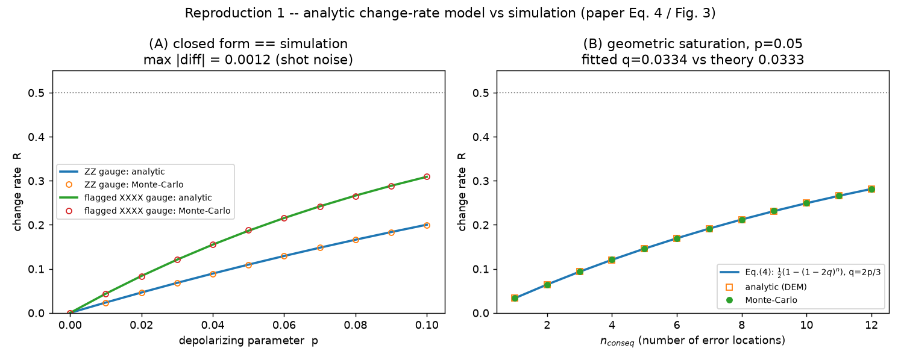
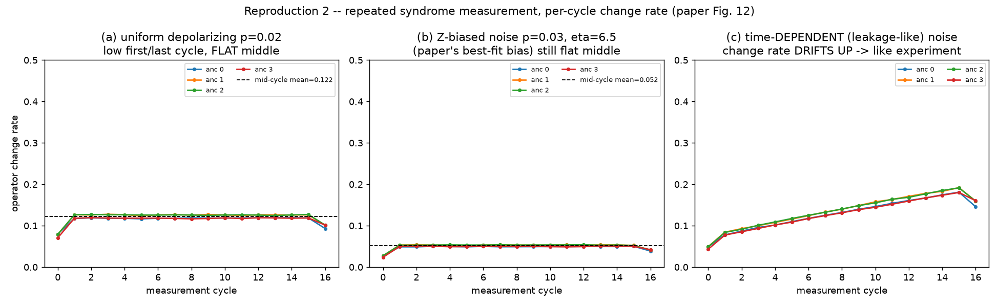
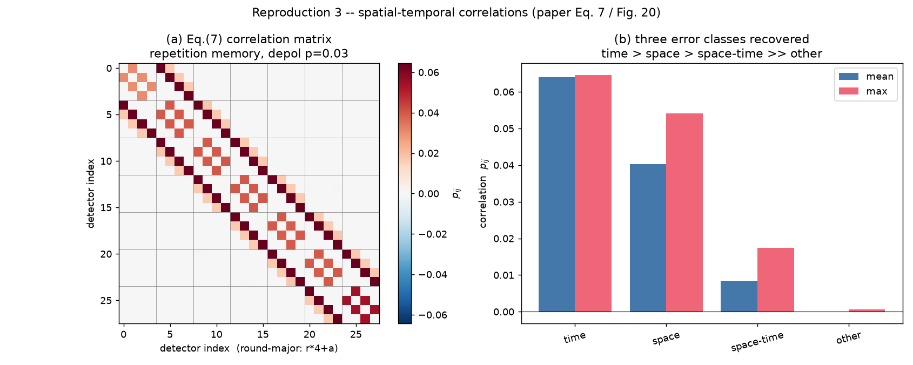
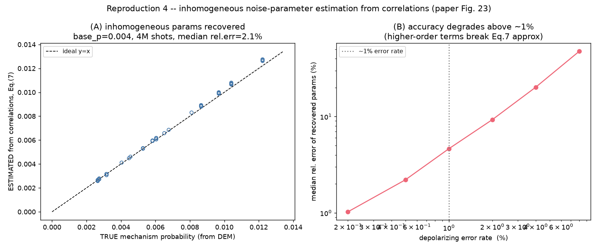

# Reproduction of Gicev, Hollenberg & Usman (PRR 6, 043249, 2024)

"Quantum computer error structure probed by quantum error correction syndrome
measurements."

This is a **self-contained** reproduction of the paper's *simulation / theory*
results (the IBM-hardware data itself needs an IBM Quantum account and cannot be
regenerated here). It is independent of the surrounding repository.

## Setup
```
pip install numpy scipy matplotlib stim
python3 repro1_change_rate.py
python3 repro2_repeated.py
python3 repro3_correlations.py
python3 repro4_estimation.py
```
Figures are written to `figs/`.

## What each script reproduces

| Script | Paper section | Result reproduced |
|--------|---------------|-------------------|
| `repro1_change_rate.py` | Eq. (4), Fig. 3 | Operator change rate is an **exact closed-form** function of the noise parameter (matches Monte-Carlo to shot noise), with the geometric structure `R = ½(1-(1-2q)^n_conseq)`. Fitted per-location flip prob `q = 0.0334` vs theory `2p/3 = 0.0333`. |
| `repro2_repeated.py` | Fig. 12 | Repeated-measurement per-cycle change rate. Depolarizing → **low first/last cycle + flat middle** (std 0.0004). Z-biased (η=6.5) → lower level, still flat. Time-dependent (leakage-like) → **upward drift** matching the experimental signature that uniform depolarizing cannot explain. |
| `repro3_correlations.py` | Eq. (7), Fig. 20 | Detection-event correlation matrix shows the three predicted classes: **time-like (0.064) > space-like (0.040) > space-time-like (0.008) >> other (~0)**. |
| `repro4_estimation.py` | Fig. 23 | Inhomogeneous per-mechanism noise probabilities are **recovered from correlations** via Eq. (7): median rel. error ~1% at 0.2% error rate, growing past ~1% error rate as higher-order terms break the approximation. |

## Results

### 1. Analytic change-rate formula vs simulation (Eq. 4 / Fig. 3)
The closed-form change rate agrees with Monte-Carlo to shot-noise level
(max |diff| = 0.0012), and the geometric `n_conseq` law is confirmed
(fitted `q = 0.0334` vs theory `2p/3 = 0.0333`).



### 2. Repeated syndrome measurement, per-cycle change rate (Fig. 12)
Uniform depolarizing gives low first/last cycles and a flat middle; Z-biased
noise only shifts the level; a time-dependent (leakage-like) component
reproduces the experimentally observed upward drift.



### 3. Spatial-temporal correlations (Eq. 7 / Fig. 20)
The detection-event correlation matrix recovers the three predicted error
classes: time-like > space-like > space-time-like >> other.



### 4. Inhomogeneous noise-parameter estimation from correlations (Fig. 23)
Per-mechanism probabilities are recovered from the correlation matrix; accuracy
is high below ~1% error rate and degrades above it.



## Method notes
- Stabilizer-circuit simulation via **stim** (Pauli/biased noise, detector sampling).
- The "analytic" change rate is computed from stim's **detector error model**:
  `R = (1 - Π_i (1-2p_i))/2` over mechanisms flipping the operator's detector —
  the generalized form of paper Eq. (4)/(6).
- The repeated Z-stabilizer circuit is a **bit-flip repetition code** memory,
  matching the paper's statement that repeated Z-gauge circuits are "essentially
  repetition-code circuits."
- Biased noise uses Eq. (3): `(r1,r2,r3) = (1/(2(η+1)), 1/(2(η+1)), η/(η+1))`.

## Caveats / not reproduced
- Real IBM `ibmq_montreal` hardware data (Figs. 3 col 4, 8–11, 20 lower triangle).
- Full heavy-hexagon flagged-XXXX *repeated* syndrome extraction (we use the ZZ
  repetition sub-circuit, which drives the Fig. 12/20 Z-operator analysis).
- The full 47-parameter inhomogeneous least-squares fit of Fig. 12 (we
  demonstrate the underlying correlation→parameter inversion instead).
